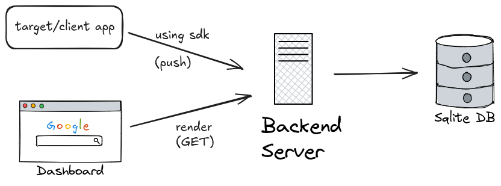

# X-Ray System - Algorithmic Debugging

X-Ray is a system for debugging non-deterministic, multi-step algorithmic pipelines. It captures the "why" behind decisions, providing transparency into complex workflows.

## Components

- **Server (Go)**: Ingestion API and query interface, backed by SQLite.
- **SDK (Node.js)**: Client library for logging traces and steps.
- **Dashboard (React/Vite)**: UI for visualizing decision traces.
- **Demo App**: A script simulating a "Content Recommendation" pipeline.

## Quick Start

### Prerequisites
- Go 1.22+
- Node.js 18+
- pnpm (only if using Makefile)

### Using Makefile

```bash
# Terminal 1: Start the server
make server

# Terminal 2: Start the dashboard
make dashboard

# Terminal 3: Run the demo to generate traces
make demo
```

- Server: `http://localhost:8080`
- Dashboard: `http://localhost:5173`

### Manual Setup

1. **Start the Backend**
   ```bash
   cd server && go run github.com/sqlc-dev/sqlc/cmd/sqlc@latest generate && go build -o xray-server && ./xray-server
   ```

2. **Start the Dashboard**
   ```bash
   cd dashboard && npm install && npm run dev # or pnpm install && pnpm dev
   ```

3. **Run the Demo**
   ```bash
   cd demo && node index.js
   ```

## Architecture



**Components:**
- **SDK**: Lightweight wrapper that sends trace/step data via HTTP. Non-blocking to avoid impacting pipeline performance.
- **Server**: Go backend with REST API for ingestion (`POST /api/traces`, `POST /api/steps`) and querying (`GET /api/traces`).
- **Dashboard**: React SPA with split-pane view—trace list on left, step details on right.

**Data Model:**
- **Trace**: A single pipeline execution (e.g., one recommendation request). Contains metadata and status.
- **Step**: A decision point within a trace. Captures `input`, `output`, and `reasoning` as JSON for flexible, domain-agnostic storage.

## Future Improvements

- Postgres for persistence
- Multi-language SDKs (Python, Go)
- Async buffering with batch ingestion for high-throughput pipelines

- Search/filter by trace name, status, date range
- WebSocket for live trace updates
- Step hierarchy tree visualization
